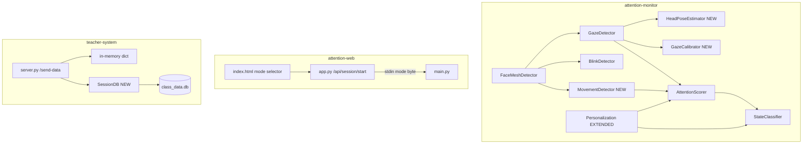

# Design Document — Attention Monitor Robustness Upgrades

## Overview

This document covers the technical design for eight targeted robustness and personalization upgrades to the existing attention monitoring system. All changes are strictly additive: new classes or methods are added to existing modules; no existing logic is removed or refactored. Every new code path falls back gracefully to the current system defaults when calibration or baseline data is unavailable.

The four areas of change are:

1. **Gaze accuracy** — head-pose compensation (Req 1) and per-user gaze calibration (Req 2)
2. **Personalization depth** — gaze stability baseline (Req 3), fatigue threshold (Req 4), off-screen threshold (Req 5)
3. **Mode selection fix** — wire the web UI mode selector to the subprocess (Req 6)
4. **Movement tracking** — nose displacement penalty (Req 7)
5. **Teacher system persistence** — SQLite session store (Req 8)

---

## Architecture



Data flow in `main.py` is unchanged at the loop level. New components are instantiated once at startup and called inside the existing `if landmarks:` block.

---

## Components and Interfaces

### Requirement 1 — HeadPoseEstimator (new sub-component in `features/gaze.py`)

Added as a helper class inside `gaze.py`. `GazeDetector.__init__` instantiates it.

```python
class HeadPoseEstimator:
    # 3D model points (approximate, fixed)
    MODEL_POINTS = np.array([...])  # nose tip, chin, eye corners, mouth corners

    def estimate_yaw(self, landmarks: list[tuple]) -> float:
        """
        Returns yaw in degrees using cv2.solvePnP with 6 landmarks.
        Returns 0.0 on failure so callers can use raw_ratio unchanged.
        Landmark indices: 1 (nose tip), 152 (chin), 33 (L eye), 263 (R eye),
                          61 (L mouth), 291 (R mouth).
        """
```

`GazeDetector.get_gaze_direction` is extended to call `HeadPoseEstimator.estimate_yaw` and apply:
```
adjusted_ratio = raw_ratio - (yaw * 0.01)
```
then use `adjusted_ratio` for threshold comparison. On `solvePnP` failure the method returns `0.0` and `raw_ratio` is used unchanged.

### Requirement 2 — GazeCalibrator (new sub-component in `features/gaze.py`)

```python
class GazeCalibrator:
    CALIBRATION_SECONDS = 7   # collect for ~7 s
    MIN_SAMPLES = 30

    def __init__(self):
        self.center_buffer: list[float] = []
        self.calibrated = False
        self.left_thresh  = 0.42   # defaults
        self.right_thresh = 0.58
        self._start: float = time.time()

    def update(self, adjusted_ratio: float) -> None:
        """Call every frame during calibration window."""

    def get_thresholds(self) -> tuple[float, float]:
        """Returns (left_thresh, right_thresh). Uses defaults until calibrated."""
```

`GazeDetector` holds a `GazeCalibrator` instance. Each call to `get_gaze_direction` passes `adjusted_ratio` to `calibrator.update()` and fetches thresholds from `calibrator.get_thresholds()` instead of the hardcoded `0.42 / 0.58`.

### Requirement 3, 4, 5 — Personalization extensions (`intelligence/personalization.py`)

New attributes added to `Personalization.__init__`:

```python
# Req 3
self.gaze_transitions: int = 0
self._prev_gaze: str = "CENTER"
self.baseline_gaze_transitions: int = 0
self.gaze_transition_threshold: float | None = None

# Req 4
self.baseline_fatigue_samples: list[float] = []

# Req 5
self.baseline_off_time_samples: list[float] = []
```

New methods added (no existing methods changed):

```python
def update(self, blink_rate, gaze, fatigue_score=0.0, off_time=0.0) -> None:
    # existing baseline_blink / baseline_gaze logic unchanged
    # additionally records fatigue_score, off_time, and gaze transitions
    # sets baseline_gaze_transitions / gaze_transition_threshold on phase end

def get_gaze_instability_penalty(self, current_transitions: int) -> float:
    """Returns penalty > 0 if current_transitions > gaze_transition_threshold, else 0."""

def get_fatigue_threshold(self) -> float:
    """Returns mean(baseline_fatigue_samples) + 15, or 60 if baseline incomplete."""

def get_off_threshold(self) -> float:
    """Returns mean(baseline_off_time_samples) + 2, or 3.0 if baseline incomplete."""
```

`main.py` passes `fatigue_score` and `off_time` to `personalization.update()` and reads the new thresholds:

```python
personalization.update(blink_rate, gaze, fatigue_score, off_time)
fatigue_thresh = personalization.get_fatigue_threshold()
off_thresh     = personalization.get_off_threshold()
state = classifier.classify(score, off_time, fatigue_score, fatigue_thresh, off_thresh)
```

`StateClassifier.classify` gains an optional `off_threshold` parameter (default `3`) so the existing call signature stays valid.

### Requirement 6 — Mode selection fix

**`attention-web/app.py`** — `/api/session/start` reads `mode` from the POST JSON body and writes it to stdin:

```python
body = request.get_json(silent=True) or {}
mode = str(body.get("mode", "1"))
if mode not in ("1", "2", "3"):
    mode = "1"
session_process.stdin.write(f"{mode}\n".encode())
```

**`attention-web/static/js/app.js`** — `toggleSession()` reads the mode selector value and includes it in the POST body:

```javascript
const mode = document.getElementById('modeSelect')?.value || '1';
const res = await fetch('/api/session/start', {
    method: 'POST',
    headers: { 'Content-Type': 'application/json' },
    body: JSON.stringify({ mode })
});
```

**`attention-web/templates/index.html`** — a `<select id="modeSelect">` element is added to the session start UI.

**`attention-monitor/main.py`** — the existing `input()` call already handles this; no change needed beyond ensuring the default fallback (`READING`) is preserved for invalid input.

### Requirement 7 — MovementDetector (`features/movement.py`)

```python
import math

class MovementDetector:
    DISPLACEMENT_THRESHOLD = 15   # pixels
    MAX_PENALTY = 10              # points

    def __init__(self):
        self._prev_nose: tuple[int, int] | None = None

    def update(self, nose_pos: tuple[int, int]) -> float:
        """
        Returns movement penalty in [0, MAX_PENALTY].
        Returns 0 on first call or after face loss.
        """
        if self._prev_nose is None:
            self._prev_nose = nose_pos
            return 0.0
        dx = nose_pos[0] - self._prev_nose[0]
        dy = nose_pos[1] - self._prev_nose[1]
        displacement = math.sqrt(dx*dx + dy*dy)
        self._prev_nose = nose_pos
        if displacement > self.DISPLACEMENT_THRESHOLD:
            penalty = min(self.MAX_PENALTY, displacement - self.DISPLACEMENT_THRESHOLD)
            return penalty
        return 0.0

    def reset(self):
        """Call when face is lost so next frame starts fresh."""
        self._prev_nose = None
```

`AttentionScorer.calculate` gains an optional `movement_penalty=0.0` parameter:

```python
score -= min(10, movement_penalty)
```

In `main.py`, `MovementDetector` is instantiated once. Inside the `if landmarks:` block, nose tip landmark index `1` is passed to `movement_detector.update()`. In the `else` (face lost) block, `movement_detector.reset()` is called.

### Requirement 8 — SessionDB for TeacherServer (`teacher-system/server.py`)

```python
import sqlite3

class SessionDB:
    def __init__(self, db_path: str = "class_data.db"):
        self._path = db_path
        self._init_db()

    def _init_db(self):
        with sqlite3.connect(self._path) as conn:
            conn.execute("""
                CREATE TABLE IF NOT EXISTS class_data (
                    id        INTEGER PRIMARY KEY AUTOINCREMENT,
                    student_id TEXT NOT NULL,
                    score      REAL,
                    state      TEXT,
                    fatigue    REAL,
                    gaze       TEXT,
                    blinks     INTEGER,
                    timestamp  TEXT
                )
            """)

    def insert(self, student_id, score, state, fatigue, gaze, blinks, timestamp):
        try:
            with sqlite3.connect(self._path) as conn:
                conn.execute(
                    "INSERT INTO class_data VALUES (NULL,?,?,?,?,?,?,?)",
                    (student_id, score, state, fatigue, gaze, blinks, timestamp)
                )
        except Exception as e:
            logger.error(f"SessionDB insert failed: {e}")
```

`SessionDB` is instantiated at module level in `server.py`. The existing `send_data` handler calls `session_db.insert(...)` after updating `class_data`. The in-memory dict and WebSocket broadcast path are untouched.

---

## Data Models

### GazeCalibrator state

| Field | Type | Description |
|---|---|---|
| `center_buffer` | `list[float]` | Adjusted iris ratios collected during calibration window |
| `calibrated` | `bool` | True once ≥ 30 samples collected |
| `left_thresh` | `float` | Active left threshold (default 0.42) |
| `right_thresh` | `float` | Active right threshold (default 0.58) |

### Personalization new fields

| Field | Type | Default | Description |
|---|---|---|---|
| `baseline_gaze_transitions` | `int` | 0 | Transition count during baseline |
| `gaze_transition_threshold` | `float\|None` | None | Set at baseline end |
| `baseline_fatigue_samples` | `list[float]` | [] | Fatigue scores during baseline |
| `baseline_off_time_samples` | `list[float]` | [] | Off-screen times during baseline |

### SessionDB schema

```sql
CREATE TABLE IF NOT EXISTS class_data (
    id         INTEGER PRIMARY KEY AUTOINCREMENT,
    student_id TEXT NOT NULL,
    score      REAL,
    state      TEXT,
    fatigue    REAL,
    gaze       TEXT,
    blinks     INTEGER,
    timestamp  TEXT
);
```

---

## Correctness Properties

*A property is a characteristic or behavior that should hold true across all valid executions of a system — essentially, a formal statement about what the system should do. Properties serve as the bridge between human-readable specifications and machine-verifiable correctness guarantees.*

### Property 1: Head-pose adjustment formula

*For any* raw iris ratio in [0, 1] and any yaw angle in [-45°, 45°], the adjusted ratio computed by `HeadPoseEstimator` SHALL equal `raw_ratio - (yaw * 0.01)`.

**Validates: Requirements 1.2**

---

### Property 2: Gaze calibration threshold derivation

*For any* `center_mean` value derived from a buffer of ≥ 30 samples, `left_thresh` SHALL equal `center_mean - 0.1` and `right_thresh` SHALL equal `center_mean + 0.1`, and `left_thresh < right_thresh` SHALL always hold.

**Validates: Requirements 2.2, 2.3, 2.5**

---

### Property 3: Gaze transition counting

*For any* sequence of gaze direction values fed to `Personalization.update` during the baseline phase, `baseline_gaze_transitions` SHALL equal the number of consecutive pairs where the direction changes.

**Validates: Requirements 3.1**

---

### Property 4: Personalization threshold formulas

*For any* non-empty list of fatigue score samples collected during baseline, `get_fatigue_threshold()` SHALL return `mean(samples) + 15`. *For any* non-empty list of off-screen time samples, `get_off_threshold()` SHALL return `mean(samples) + 2`.

**Validates: Requirements 4.2, 5.2**

---

### Property 5: Gaze instability penalty signal

*For any* current gaze transition count and any `gaze_transition_threshold`, `get_gaze_instability_penalty` SHALL return a value > 0 if and only if `current_transitions > gaze_transition_threshold`.

**Validates: Requirements 3.3**

---

### Property 6: Nose displacement computation

*For any* two consecutive nose tip positions `(x1, y1)` and `(x2, y2)`, `MovementDetector.update` SHALL compute displacement as `sqrt((x2-x1)² + (y2-y1)²)` and return a penalty > 0 if and only if displacement exceeds the threshold (default 15 px), capped at 10 points.

**Validates: Requirements 7.2, 7.3, 7.4**

---

### Property 7: Dual-store consistency

*For any* valid student data record posted to `/send-data`, both the in-memory `class_data` dict and the SQLite `class_data` table SHALL contain an entry for that `student_id` with the same `score`, `state`, `fatigue`, `gaze`, `blinks`, and `timestamp`.

**Validates: Requirements 8.2, 8.3**

---

## Error Handling

| Scenario | Handling |
|---|---|
| `cv2.solvePnP` returns `False` or raises | `HeadPoseEstimator.estimate_yaw` returns `0.0`; `adjusted_ratio == raw_ratio` |
| Fewer than 30 calibration samples | `GazeCalibrator.get_thresholds()` returns `(0.42, 0.58)` |
| Baseline phase not yet complete | All three `Personalization.get_*` methods return system defaults (60, 3.0, no penalty) |
| Face lost between frames | `MovementDetector.reset()` clears `_prev_nose`; next frame returns penalty 0 |
| SQLite insert failure | `SessionDB.insert` catches the exception, logs it, and returns; HTTP response is unaffected |
| Invalid mode value from web UI | `main.py` defaults to `READING`; `app.py` validates and defaults to `"1"` before writing to stdin |

---

## Testing Strategy

### Unit tests (example-based)

- `HeadPoseEstimator.estimate_yaw` with known landmark coordinates returns a plausible yaw value
- `GazeCalibrator` uses default thresholds before 30 samples, switches after
- `Personalization.get_fatigue_threshold()` returns 60 before baseline ends
- `Personalization.get_off_threshold()` returns 3.0 before baseline ends
- `MovementDetector.update` returns 0 on first call
- Mode mapping: all three valid inputs (`"1"`, `"2"`, `"3"`) map to correct strings; invalid input maps to `READING`
- `SessionDB._init_db` creates the `class_data` table on a fresh in-memory database

### Property-based tests

Uses **Hypothesis** (Python). Each property test runs a minimum of 100 iterations.

- **Property 1** — `@given(raw_ratio=floats(0,1), yaw=floats(-45,45))` — verify `adjusted == raw - yaw*0.01`
- **Property 2** — `@given(samples=lists(floats(0.1,0.9), min_size=30))` — verify threshold derivation and `left < right`
- **Property 3** — `@given(gazes=lists(sampled_from(["LEFT","CENTER","RIGHT"]), min_size=1))` — verify transition count
- **Property 4** — `@given(fatigue_samples=lists(floats(0,100), min_size=1), off_samples=lists(floats(0,10), min_size=1))` — verify threshold formulas
- **Property 5** — `@given(count=integers(0,100), threshold=floats(0,100))` — verify penalty signal logic
- **Property 6** — `@given(p1=tuples(integers(0,640),integers(0,480)), p2=tuples(integers(0,640),integers(0,480)))` — verify displacement and penalty cap
- **Property 7** — `@given(data=student_data_strategy())` — verify both stores contain the record after a POST

Tag format for each test: `# Feature: attention-monitor-robustness-upgrades, Property N: <property_text>`

### Integration tests

- POST to `/send-data` with valid data → verify SQLite row inserted (Req 8.2)
- Mock SQLite to raise → verify HTTP 200 still returned and error logged (Req 8.4)
- `app.py` `/api/session/start` with `{"mode": "2"}` → verify `b'2\n'` written to subprocess stdin (Req 6.1)
